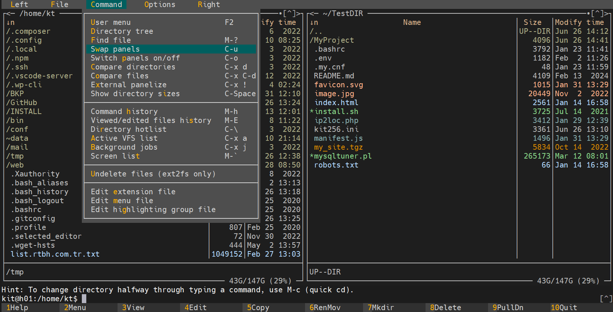
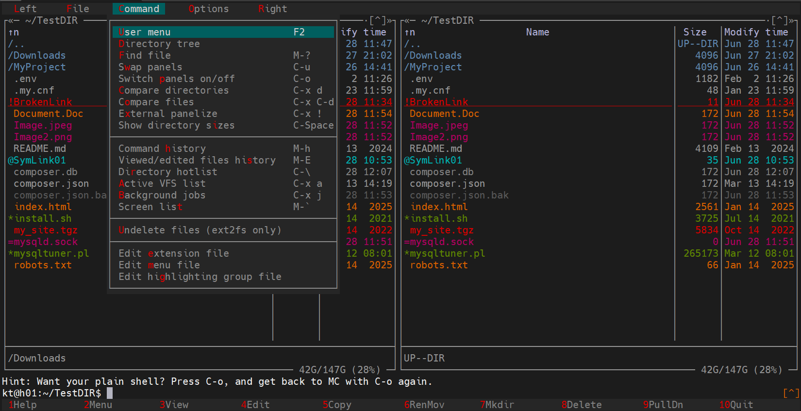

# Midnight Commander Themes

This is a 256-color theme for [Midnight Commander](https://midnight-commander.org/),  designed with a light color scheme and high contrast for readability and comfort.

## `kit256.ini`



## `kit256-sd.ini`



---

## 💾 Installation via Script

1. Clone the repository:

   ```bash
   git clone https://github.com/kit400/mc-themes.git 
   cd mc-themes
   chmod +x install.sh
   ./install.sh
   ```
   Follow the on-screen instructions to choose between user-wide or system-wide installation.
   
 
## 🧵 Option 2: Manual Installation 
 
 ```bash
git clone https://github.com/kit400/mc-themes.git 
cd mc-themes
```

Copy the theme file manually:

```bash
   cp kit256.ini ~/.local/share/mc/skins/
```
For system-wide install:
```bash
   sudo cp kit256.ini /usr/share/mc/skins/
```

After installation, open mc, press F9 → Options → Appearance, and select kit256.

Or

 ```bash 
 sed -i 's|\(^skin=\).*$|\kit256|' ~/.config/mc/ini
 ```